# 想法汇总

### eeg

1. eeg 通道位置的 position embedding

### 图片

1. 图片不用 resize，而是往白布上覆盖
2. 提取图片的时候用关键帧算法
3. 提取图片时候如何最完整的获取人脸、背景如何处理
4. swin 的原理

### 模态融合

1. 判断两个模态的贡献

### 其他

1. 倒数 4 层 hidden_layer 取平均输出

# 论文

### Combining Facial Expressions and Electroencephalography to Enhance Emotion Recognition

- detail
  - Future Internet, 2019 - mdpi.com
  - Cited by 115
  - 华南师范大学
- overview of the workflow
  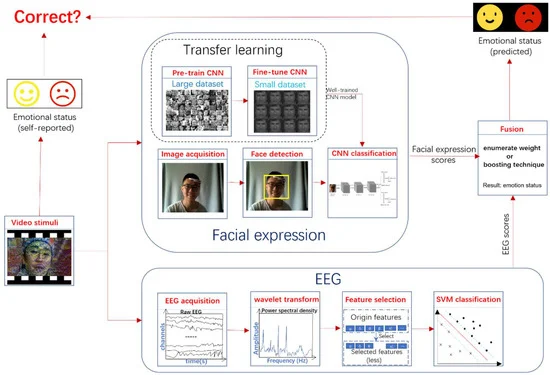
  
  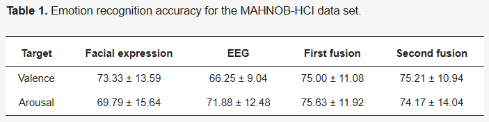
- Visualization
  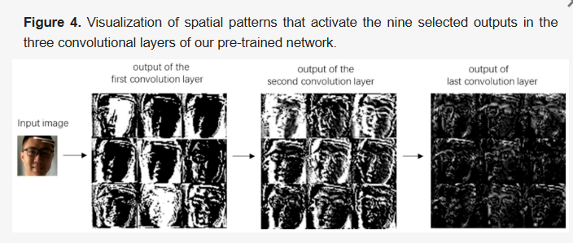
  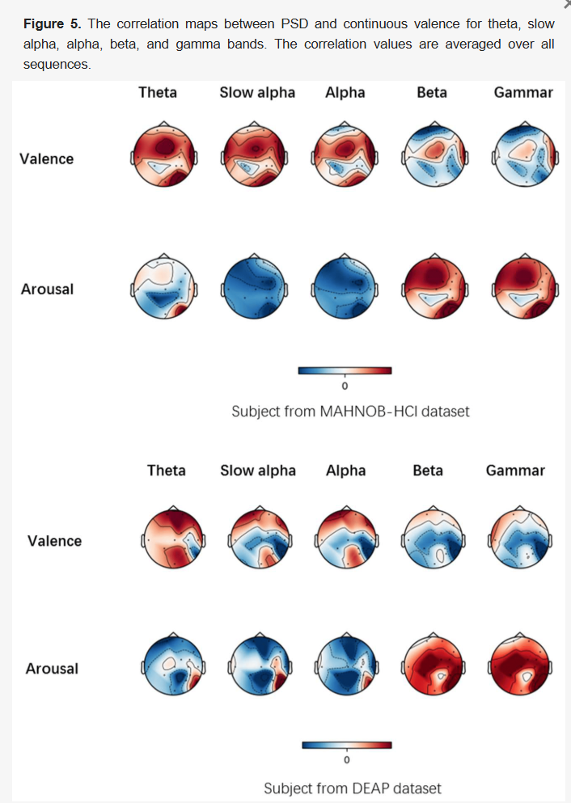

### Emotion_Recognition_Based_on_DEAP_Database_Physiological_Signals

- detail
  - 29th Telecommunications forum TELFOR 2021
  - 搞得比较简单

### A Bimodal Emotion Recognition Approach through the Fusion of Electroencephalography and Facial Sequences

- detail
  - Diagnostics, 2023 - mdpi.com
  - Cited by 15
  - todo 看看 DCCA 是什么？
  - todo video 怎么变成图片
- framework
  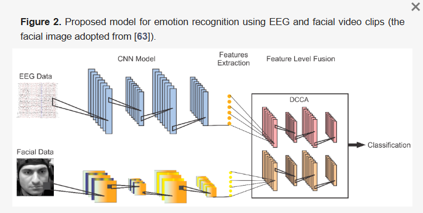
  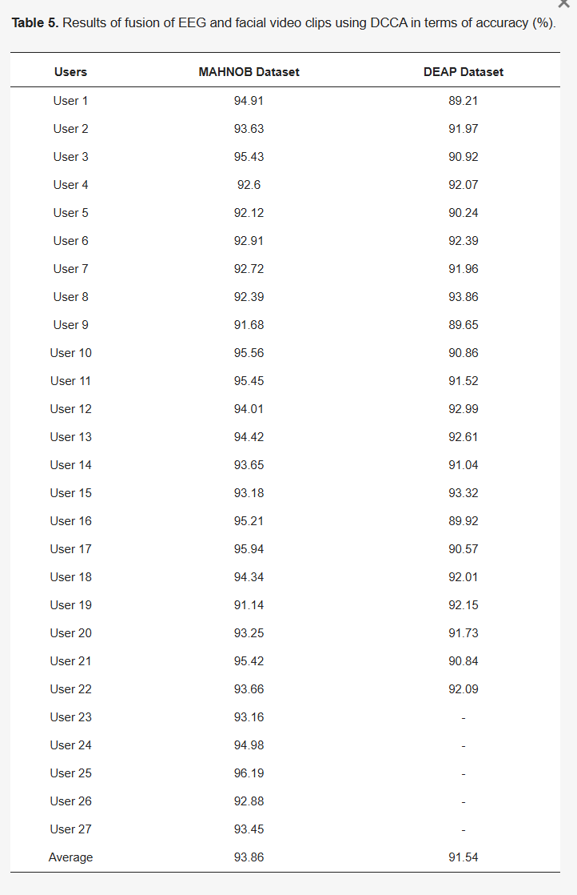

  todo 我的 eeg 过没过模型提特征，现在是用的 vilt 的思想嘛
  todo 对比学习 pairwise 关注一下

### Speech Emotion Recognition Enhanced Traffic Efficiency Solution for Autonomous Vehicles in a 5G......

- IEEE Transactions on Intelligent Transportation Systems 2021
  - 四川师范大学
  - Cited by 154
- 主要创新点不在模型结构这里，这篇论文写的更像大论文，讲了很多人尽皆知的东西而少了创新
  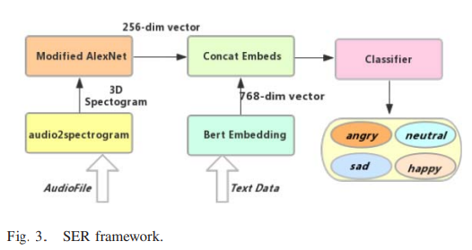
  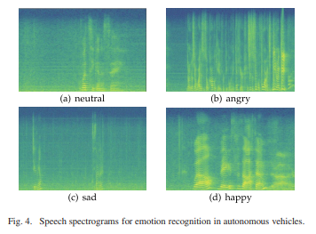
  这个图有点意思

### Efficient Low-rank Multimodal Fusion with Modality-Specific Factors

- 2018 年多模态起步阶段的著名文章，引用 905 次
- 简单清晰
- 没有用 transformer
  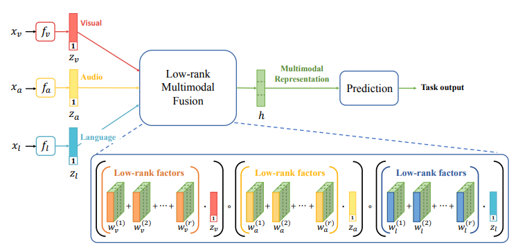
  todo 没写完看完视频

### MultiMAE-DER Multimodal Masked Autoencoder for Dynamic Emotion Recognition

可以看一下他的模态融合方法

# CCA & Deep CCA

## CCA 典型关联分析(Canonical Correlation Analysis)

- 上述论文提到过 DCCA`A Bimodal Emotion Recognition Approach through the Fusion of Electroencephalography and Facial Sequences`
- 这篇文章讲了 CCA 的推导`https://zhuanlan.zhihu.com/p/52717082`
- 这篇文章讲 CCA 和 DCCA，他讲得更好`https://zhuanlan.zhihu.com/p/32755775`

  - 这个 Deep CCA 可以看做是：
    第一个 View 通过 LSTM 来处理序列信息。
    第二个 View 通过 CNN 来处理图像信息。
    然后，我们将两个 Deep 网络学到的 feature 拿出来做 CCA。

- Deep CCA 就是先用深度神经网络分别求出两个视图的经过线性化的向量，然后求出两个投影向量的最大相关性，最后求出新的投影向量。用这个投影向量加入到机器学习算法进行分类，聚类回归。

- Deep CCA 论文
  - Galen Andrew, Raman Arora, Jeff Bilmes, Karen Livescu, "Deep Canonical Correlation Analysis." ICML. 2013.
  - Cited by 2370

# 多模态学习

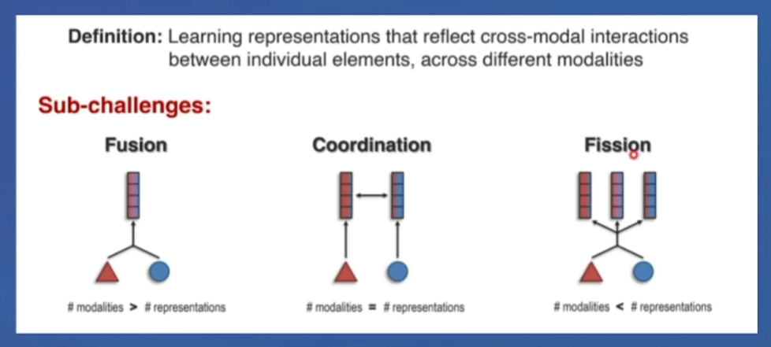
分为三类，我主要在做 fusion

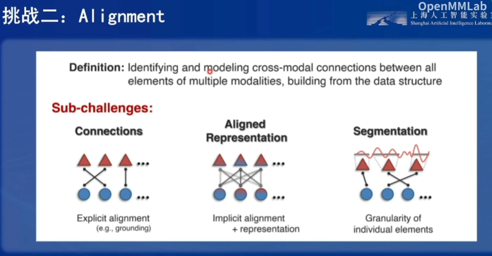
第二个挑战：如何做对齐

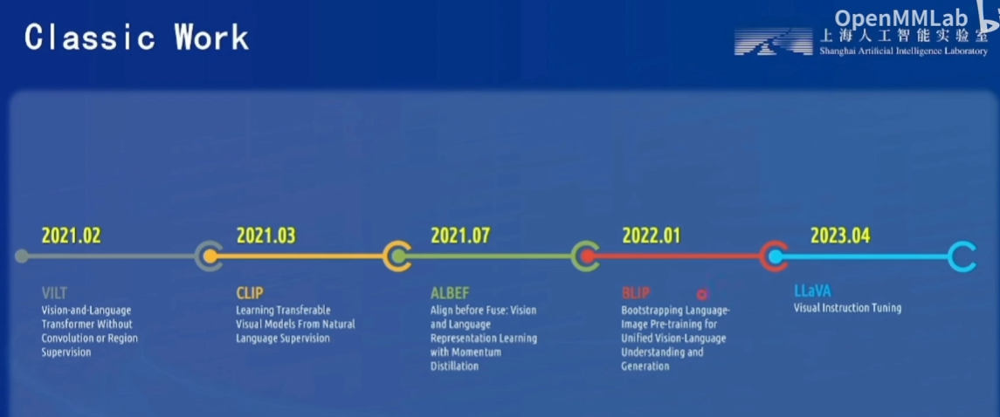
优秀的论文

### CDDFuse CVPR2023

- 这篇文章是 MMIF(Multi-Modality Image
  Fusion)领域的，跟我的领域不太一样但是思想值得借鉴
- 视频来源
  `https://www.bilibili.com/video/BV1zu411s7nm/?vd_source=f3b6f7ea89f476bf0d6f43803af78d7f`
  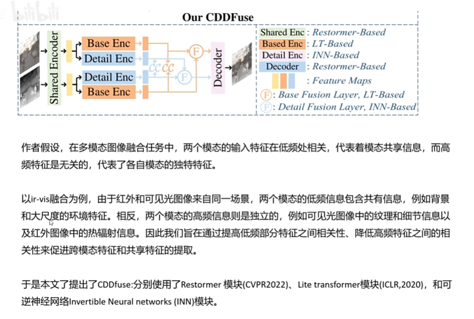
  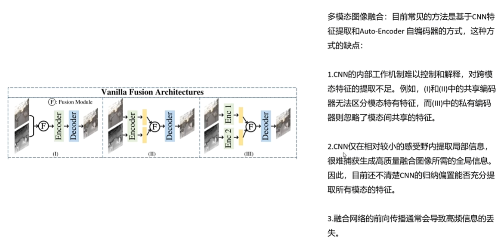
- CNN 的内部工作机制难以控制和解释,对跨模态特征的提取不足。例如,(I)和(II)中的共享编码器无法区分模态特有特征,而(III)中的私有编码器则忽略了模态间共享的特征。
- 这篇文章的 SOTA 比较部分很不错，写论文的时候学习一下
  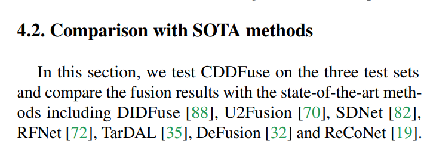
