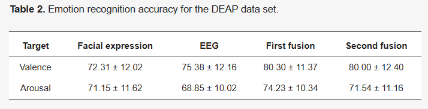

# 想法汇总
### eeg
1. eeg通道位置的position embedding

### 图片
1. 图片不用resize，而是往白布上覆盖
2. 提取图片的时候用关键帧算法
3. 提取图片时候如何最完整的获取人脸、背景如何处理
4. swin的原理

### 模态融合
1. 判断两个模态的贡献

### 其他
1. 倒数4层hidden_layer取平均输出

# 论文

### Combining Facial Expressions and Electroencephalography to Enhance Emotion Recognition
- detail
  - Future Internet, 2019 - mdpi.com
  - Cited by 115
  - 华南师范大学
- overview of the workflow

- Visualization 

### Emotion_Recognition_Based_on_DEAP_Database_Physiological_Signals
- detail
  - 29th Telecommunications forum TELFOR 2021
  - 搞得比较简单

### A Bimodal Emotion Recognition Approach through the Fusion of Electroencephalography and Facial Sequences
- detail
  - Diagnostics, 2023 - mdpi.com
  - Cited by 15
  - todo 看看DCCA是什么？
  - todo video怎么变成图片
- framework
  
  

  todo 我的eeg过没过模型提特征，现在是用的vilt的思想嘛
  todo 对比学习pairwise关注一下
  